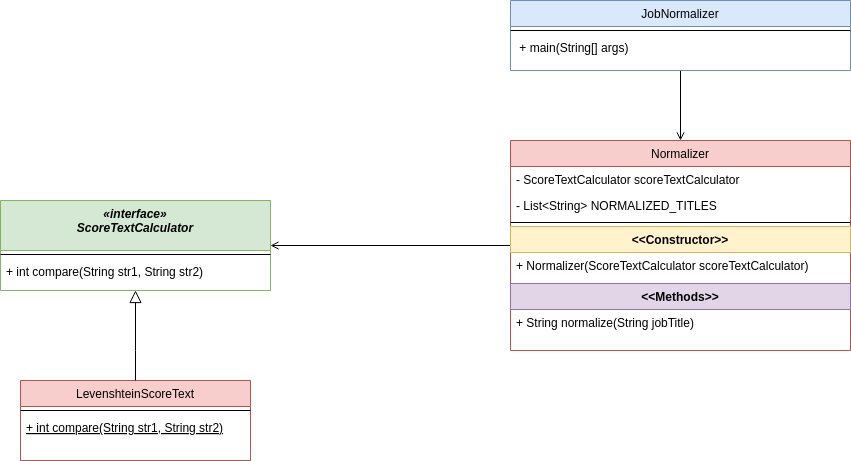

# Job Title Normalizer

## Overview
The Job Title Normalizer is a Java application that normalizes job titles to a predefined set of normalized titles. Given an input job title, the application returns the closest match from the list of normalized titles using the Levenshtein distance metric.

## Classes and Responsibilities

### `JobNormalizer.java`
This class contains the main method and serves as an entry point to demonstrate the normalization functionality.

### `Normalizer.java`
This class is responsible for normalizing job titles. 

There's a dependency for **score text comparator** to compute the distance between the input title and each of the normalized titles.

The default implementation for ScoreTextComparator is the Levenshtein Distance.

### `ScoreTextCalculator.java`
This interface describes what a score text calculator should look like.

### `LevenshteinScoreCalculator.java`
This class is an implementation for a score text calculator used by the Normalizer class.

## Class Diagram
It was used **Dependency Injection** pattern for best practices in OOP achieving decoupled components and higher flexibility.



## Dependencies
The project uses the following dependencies:
- Apache Commons Text: For calculating Levenshtein distance - instead of implementing your own features - providing a higher reliability and security.
- JUnit 5: For unit testing.
- Mockito Core: For mocking objects in test scenarios.

The dependencies are managed using Maven, specified in the `pom.xml` file.

# How to Run the Job Title Normalizer Program

## Prerequisites
- Java Development Kit (JDK) 17 or higher
- Apache Maven 3.6.0 or higher

## Steps to Run the Program

1. **Clone the Repository**

   Clone the repository to your local machine using the following command:
   ```bash
   git clone <repository-url>
   ```

2. **Navigate to the Project Directory**

    Change your working directory to the project directory:
   ```bash
   cd job-normalizer
   ```

3. **Build the Project**

   Use Maven to build the project and download the necessary dependencies:
   ```bash
   mvn clean install
   ```

4. **Run the Program**

   Execute the main class to run the program:
   ```bash
   mvn exec:java -Dexec.mainClass="com.jobnormalizer.JobNormalizer"
   ```

